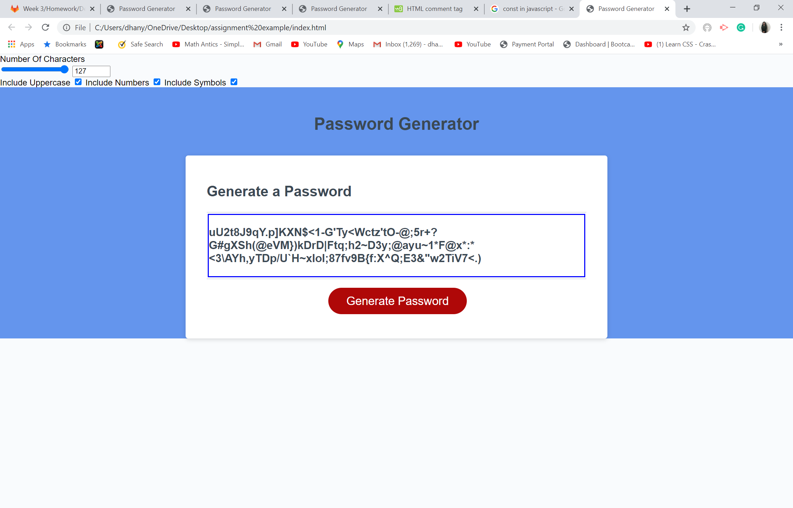

This is a password Generator program by using javascript. The minimum characters we are using to create a password is 8 according to users requirement and maximum is 128 character.
I made a program which satisfy the customer requirement by adding uppercase, lowercase(that is by default), special charecters and numbers. 
To make very clean code I used ASCII code for my program.
I declared constant values to call function when needed.
The other great advantage of javascript I used is the mathfunction, that math.floor and math.random. Math.random gets the random value from an array and math.floor makes that random value in to an integer.
User can input the amount of elements they need in their password from 8 to 128 and according their choice they may output with the strong password.
you can see my wonderful password generator here.
 https://dhanya-krishnan2.github.io/passwordgenarater/
I used event handling function to make it more interactive.
My screenshots of the output are given in a separate folder.
I used input tags to make slider output which helps the users to slide the bar to assign the amount of elements they need in their password.
Below are some screen shot of my output which is generating the passwords randomly according to users choice of total characters they want to make their more secure.
.png)

.png)
.png)
